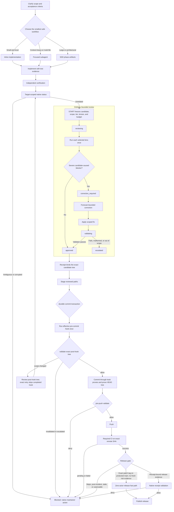

# gentle-pi

[](https://www.npmjs.com/package/gentle-pi)
[](https://pi.dev/packages/gentle-pi)
[](LICENSE)
[](https://github.com/Gentleman-Programming/gentle-pi/stargazers)
[](https://github.com/Gentleman-Programming/gentle-ai)
[](https://github.com/Gentleman-Programming)
[](https://www.youtube.com/c/GentlemanProgramming)
[](https://discord.com/invite/gentleman-programming-769863833996754944)
[](#sddopenspec-flow)
[](#what-it-adds)

**Turn Pi from a powerful coding agent into a controlled development harness.**

`gentle-pi` installs **el Gentleman** in Pi: a senior-architect operating layer for Spec-Driven Development, focused subagents, strict TDD evidence, reviewable work units, safety guards, project/user skill discovery, and bounded native review.

Pi already has strong tools. `gentle-pi` adds the discipline for using them well, then binds review and delivery decisions to Git-derived evidence instead of agent narration.

`gentle-pi` is the Pi-native package from the [Gentle-AI ecosystem](https://github.com/Gentleman-Programming/gentle-ai), built by [Gentleman Programming](https://github.com/Gentleman-Programming): the broader open-source project for turning AI coding agents into disciplined engineering environments with SDD workflows, skills, memory integrations, model routing, and review guardrails across multiple agents.

Follow the project and the community around it:

- GitHub: [Gentleman-Programming](https://github.com/Gentleman-Programming)
- YouTube: [Gentleman Programming](https://www.youtube.com/c/GentlemanProgramming)
- Community Discord: [Gentleman Programming](https://discord.com/invite/gentleman-programming-769863833996754944)

Startup intro collaboration: thanks to [@aporcelli](https://github.com/aporcelli) for [`pi-gentle-startup`](https://github.com/aporcelli/pi-gentle-startup), which inspired the clean-screen startup animation, compact runtime panel, and pink visual treatment.

## The problem

Most coding-agent sessions fail for operational reasons, not model reasons:

- the agent jumps into code before requirements are clear;
- architectural decisions disappear into chat history;
- one request quietly becomes a huge multi-area diff;
- tests run late, or not at all;
- reviewers get handed a wall of changes;
- subagents are available, but the parent session has no orchestration discipline;
- project skills exist, but the model forgets to load them.

`gentle-pi` fixes the workflow around the agent.

## What it adds

| Capability                     | What it does                                                                                                                                  |
| ------------------------------ | --------------------------------------------------------------------------------------------------------------------------------------------- |
| **el Gentleman persona**       | Makes Pi behave like a senior architect and teacher, not a generic chatbot. Spanish responses use Rioplatense voseo by default; neutral mode is saved globally with project overrides. |
| **Configurable startup intro** | Adds a rose/text-logo startup intro, compact runtime panel, color presets, and commands to hide or show the decorative parts.                  |
| **Work routing discipline**    | Small tasks stay inline. Context-heavy exploration can be delegated. Large or risky changes go through SDD/OpenSpec.                          |
| **SDD/OpenSpec assets**        | Installs phase agents and chains for `init`, `onboard`, `explore`, `proposal`, `spec`, `design`, `tasks`, `apply`, `verify`, `sync`, and `archive`. |
| **Lazy SDD preflight**         | Asks once per session for SDD mode, artifact store, PR chaining strategy, and review budget before the first SDD flow.                        |
| **Subagent orchestration**     | Keeps one parent session responsible while child agents explore, implement, test, or review with focused context.                             |
| **Strict TDD support**         | When project config declares a test command, apply/verify phases must record RED → GREEN → TRIANGULATE → REFACTOR evidence.                   |
| **Reviewer protection**        | Surfaces review workload risk before a task turns into an oversized PR.                                                                       |
| **Per-agent model assignment** | Pi-native modal for assigning stronger or cheaper models to specific SDD/custom agents.                                                       |
| **Skill discovery registry**   | Maintains `.atl/skill-registry.md` from project and user skills so review/comment/PR workflows do not silently miss the right skill.          |
| **Skill creation workflow**    | Provides the `gentle-ai-skill-creator`/`gentle-ai-skill-improver` skills, `/skill-creation` prompt, and packaged style guide for LLM-first skills. |
| **Delivery skills**            | Includes issue-first PRs, chained PRs, work-unit commits, cognitive docs, comment writing, and Judgment Day review.                           |
| **Bounded native review**      | Freezes one candidate, dispatches only controller-selected lenses, records native authority, and reuses the same content-bound receipt at delivery gates. |
| **Verified native runtime**    | Provisions the exact package-local Gentle AI v2.1.10 binary, verifies pinned archive/binary integrity, negotiates `review-integration/v1`, and rejects PATH, global, sibling, symlink, and mode fallbacks. |
| **Runtime safety**             | Blocks destructive shell commands, asks for confirmation for sensitive operations, and blocks direct read/write/edit access to sensitive paths. |

## Install

```bash
pi install npm:gentle-pi
```

The npm postinstall downloads the exact platform-specific official Gentle AI v2.1.10 archive into this package's private `.gentle-ai/v2.1.10/` directory and verifies its pinned archive and executable SHA-256 values before extraction. It never uses `PATH` or a global `gentle-ai` installation. For development or offline installs only, set `GENTLE_PI_SKIP_GENTLE_AI_INSTALL=1`; native review operations then fail closed with an actionable `package-local-binary-missing` error until the package is reinstalled normally.

Recommended companion packages:

```bash
pi install npm:pi-subagents-j0k3r
pi install npm:pi-intercom
pi install npm:gentle-engram
pi install npm:pi-web-access
pi install npm:pi-lens
pi install npm:@juicesharp/rpiv-todo
pi install npm:@juicesharp/rpiv-ask-user-question
```

Then start Pi in a project:

```bash
pi
```

`gentle-pi` provides SDD agents as global Pi runtime assets, not per-project setup. The first SDD flow in a session still runs a one-time SDD preflight for preferences; for natural-language requests, el Gentleman decides when SDD is needed and runs the explicit preflight first.

## Quick start

```text
/gentle:status          Check package, SDD assets, OpenSpec, and global model config.
/gentle:doctor          Run read-only diagnostics for SDD assets, config, tools, and guards.
/gentle:sdd-preflight   Run or reuse the session SDD preflight explicitly.
/sdd-init                  Create or refresh openspec/config.yaml.
/gentle:models             Assign global model/effort routing to SDD/custom agents.
/gentle:persona            Switch between gentleman and neutral persona modes.
/gentle:banner             Configure startup rose, text logo, and color preset.
/gentle:commit-status      Inspect an unresolved durable commit transaction.
/gentle:commit-abort       Abandon safe recovery state without changing HEAD or the index.
```

Typical flow:

1. Open Pi in your repo.
2. Run `/gentle:status`.
3. Run `/sdd-init` once per project, or when test/project capabilities change. This also runs the session SDD preflight.
4. For a substantial change, ask Pi to use SDD. Natural-language requests are classified by the parent agent, not by brittle runtime regexes.
5. Review the phase artifacts instead of trusting floating chat context.

## Core workflow

1. **Install and inspect.** Install `gentle-pi`, open Pi in the target repository, then run `/gentle:status` or `/gentle:doctor`.
2. **Plan when risk justifies it.** Small work stays direct; substantial work uses SDD with Engram, OpenSpec, or both so requirements and decisions survive compaction.
3. **Build with evidence.** One focused writer implements the approved scope. When Strict TDD is available, apply and verify preserve RED → GREEN → TRIANGULATE → REFACTOR evidence.
4. **Review one candidate.** Native START derives and freezes the Git candidate, risk tier, selected lenses, authored-line budget, and correction allowance. Review actors assess that immutable view; they do not grant authority.
5. **Deliver the same candidate.** FINALIZE records native authority and an approved receipt. Commit, push, PR, and release gates validate that same receipt and live Git target with zero review actors; they never silently reopen review or reset its budget.

> **Trust what the system can derive, not what an agent claims.** Agents analyze the candidate. The package-local Gentle AI runtime owns scope, risk, findings, receipts, and lifecycle gates. This protects against accidental scope and identity drift, not a malicious same-user process that can replace local code or authority. See Gentle AI's [review authority threat model](https://github.com/Gentleman-Programming/gentle-ai/blob/main/docs/review-authority-threat-model.md) and [Chapter 21 — Verifiable Trust](https://the-amazing-gentleman-programming-book.vercel.app/en/book/Chapter21_Verifiable-Trust).

## How the harness decides what to do

`gentle-pi` routes through the smallest safe workflow:

| Request shape                                                               | Harness                      |
| --------------------------------------------------------------------------- | ---------------------------- |
| Small, clear, local edit                                                    | Inline direct work.          |
| Unknown codebase area or context-heavy investigation                        | Focused subagent delegation. |
| Large, ambiguous, architectural, product-facing, or high-review-risk change | SDD/OpenSpec flow.           |

The goal is not ceremony. The goal is to avoid accidental chaos. Once a task stops being small, delegation is mandatory.

### Delegation triggers

`gentle-pi` keeps the parent session thin and delegates at the narrowest useful point. When the Pi Subagents extension is installed, the preferred runtime is the `subagent_*` tool family because it runs the user's configured project/global subagent definitions and preserves history/background behavior. Use waiting/task mode when the parent must consume the result and continue the workflow; use background mode only for independent work where parent continuation is not required. If those tools are unavailable, the parent should fall back to Pi's native `Agent` tool or another available delegation mechanism. The requirement is delegation; the runtime is capability-dependent.

| Trigger                                                                                                                     | Required behavior                                                             |
| --------------------------------------------------------------------------------------------------------------------------- | ----------------------------------------------------------------------------- |
| Reading 4+ files to understand a flow                                                                                       | Launch `scout`, `context-builder`, or the closest read-only mapping subagent. |
| Touching 2+ non-trivial code files                                                                                          | Delegate one writer; do not continue inline unless delegation is unavailable. |
| Commit, push, or PR after code changes                                                                                      | Validate the approved receipt and exact typed target with zero actors.        |
| Wrong cwd, worktree/git accident, merge recovery, confusing test/env issue                                                  | Stop, preserve the frozen scope, investigate separately, and validate the existing receipt; never launch a fresh review lens or reopen review as incident handling. |
| Long monolithic session with accumulating complexity, roughly 20 tool calls, 5 exploratory reads, or 2 non-mechanical edits | Pause and delegate the remaining work, or stop and explain the exact blocker. |

The intended balanced loop for a bounded bugfix is:

```text
parent git/status + clarify → bind ordinary snapshot/route → one worker writes authorized fixes → targeted proof validation when required → final verification
```

Review lenses are controller-selected transaction actors, not lifecycle hooks. `scout`/`context-builder` save parent context by compressing broad exploration. `worker` preserves a single writer thread. Commit, push, PR, and release validate receipts with zero actors.

Review actors are dispatched only through parent `subagent_run` calls in `mode: "task"`. Before execution, the controller verifies every entry, content hash, mode, root, and index in one selected immutable candidate tree per requested lens, then appends one bounded controller-owned block containing only the Git-derived base-to-candidate changed scope. That compact scope groups present paths by exact candidate mode and lists deletions explicitly; it fails closed when the changed scope itself exceeds the dispatch bound. Mixed batches, unselected/missing/stale views, user-supplied candidate-view text, unsafe paths, and non-task dispatches fail closed; lean resources and actor tool allowlists remain unchanged.

### Review authority recovery and reset safety

Legacy pre-graph authority is never migrated. `gentle_review inspect` reports an exact repository-bound destructive reset challenge for legacy corruption; after that fresh interactive authorization, RESET and RECOVER_LOCK route to the audited native `gentle-ai review reclaim` operation and RECOVER routes to native `gentle-ai review recover`, so every destructive transition is executed and audited by the native authority store. Native inputs the request did not carry return a `native-input-required` envelope instead of being invented. Existing graph-v1 ordinary lineages remain readable and gate-validatable but are read-only; Judgment Day remains mutable on graph-v1.

`gentle_review abandon`, `quarantine-legacy`, and `reconcile-authority` remain explicit v2.1.10 maintenance routes. Pi derives and displays the published six-line abandon binding only for a caller-specified compact lineage, revision, and snapshot identity; the native CLI re-derives pristine compact-v2 eligibility. Legacy quarantine accepts only `historical findings freeze changed unrelated transaction state` with disposition `quarantine-malformed-freeze-event` and uses its exact eight-line binding. Both require fresh interactive approval and fail closed headlessly.

`gentle_review reconcile-authority` accepts one predecessor lineage and revision, one successor lineage and revision, an actor, and a reason. Pi derives the exact seven-line `gentle-ai.review-reconcile-authorization/v1` binding, or appends exactly `anomalies=unchanged_target,malformed_recovery_authorization` for the published dual anomaly in that order. Native code re-derives every anomaly; malformed bindings, changed revisions, unavailable native support, cancellation, and native refusal fail closed through typed envelopes.

Reconciliation is intentionally narrow: native code may quarantine only the bound invalid compact-v2 recovery successor and persists the returned audit record; the predecessor stays untouched. Pi never recreates the retired `prepare-supersession`/`supersede` authority writer and never falls back to RESET or RECOVER.

`gentle_review repair-legacy-alias` is the sole v2.1.10 route for `unsupported historical v1 operation alias`. The model supplies only lineage, actor, and reason. Pi freshly reads the native inventory, derives the canonical repository, exact legacy revision, fixed diagnostic, and fixed `quarantine-approved-historical-alias` disposition, displays the LF-only eight-line binding, and requires a new interactive approval. Native re-derives eligibility and quarantines rather than rewriting or validating the historical chain.

`review dispose-result` is deliberately unsupported by Pi pending a separate design; it has no controller operation or fallback. All maintenance routes fail closed headlessly and never auto-run against legacy history.

Native ordinary gates revalidate provider-selected authority, receipt, scope, intended-untracked proof, and the live target. Pi preserves a graph-v1 gate path only for explicit Judgment Day and historical graph receipt validation. Recovery grants no new budget and cannot bypass dangerous-command or publication checks. Legacy graph bundle export/import is retired.

This is the post-U8 boundary, not the final architecture. [Issue #191](https://github.com/Gentleman-Programming/gentle-pi/issues/191) is the immediate final unit in this same delivery: extract the remaining Pi command-projection and lifecycle-gate surface from `review-transaction.ts`, repoint runtime enforcement, then delete only dependencies proven unreachable without weakening graph-v1 Judgment Day. The branch-wide High-tier 4R runs after that extraction, before the single size-exception PR.

`reviewer` is not an installed subagent name. It is a routing intent. Select the concrete lens by risk profile:

| Context | Review lens |
| --- | --- |
| Clear naming, structure, maintainability, small refactors | `review-readability` |
| Behavior, state, tests, determinism, regressions | `review-reliability` |
| Shell/process integration, partial failures, recovery, degraded dependencies | `review-resilience` |
| Security, permissions, data exposure/loss, architecture, dependencies | `review-risk` |
| Large PR, hot path, or >400 changed lines | Full 4R: `review-risk`, `review-resilience`, `review-readability`, `review-reliability` |

Risk selection is deterministic: documentation/comment/formatting-only changes use zero lenses; every other standard change uses exactly one dominant-risk lens; security/auth/update/payment paths, data-loss or exposure risk, shell/process integration, or more than 400 authored changed lines use the full 4R set. A standard review never accumulates multiple lenses ad hoc.

### Bounded review transactions

New ordinary review uses compact `gentle_review` `start -> finalize -> validate`. This diagram shows the complete development-to-delivery path, including every ordinary review state and the fail-closed branches.



Lifecycle gates never launch review actors. They rederive Git and publication targets, validate the existing receipt, and authorize one exact command. Any target drift, stale evidence, malformed authority, or unprovable state blocks delivery instead of silently reopening review.

Native contract pairing is exact: this adapter resolves only the integrity-verified package-local Gentle AI v2.1.10 executable, independently hashes it, then negotiates `gentle-ai.review-integration/v1` outside the repository. Capabilities are cached by that executable digest. Every START, target status, FINALIZE, validate, and BIND-SDD request passes the same contract identifier. Current protocol 1.0 envelopes decode exactly against the vendored schemas; `recover` routes only the provider-selected `action_disposition`, and optional additions require a future compatible schema/minor that the provider explicitly advertises and the consumer negotiates.

Target status owns `current_target`, `unrelated`, `ambiguous`, and `corrupted` applicability and returns one native action. Pi does not reconstruct ordinary authority from provider-private files or choose a lineage from repository-wide history. Restart recovery rebuilds only the derived candidate view from the native Git/content projection, including intended-untracked paths, symlinks, and immutable gitlink identities. Native failure envelopes retain their exact mutation outcome, replayability, required inputs, request digest, and next action. After an unknown or lost mutating result, Pi calls target status before any replay decision and returns only the provider-declared action.

Direct authorized `git commit` commands use a durable recovery record under the Git common directory. The package runs the effective pre-commit hook once, captures the post-hook index, performs final native validation against that tree, suppresses only the already-completed pre-commit hook while preserving message/post hooks through proxies, and proves `HEAD^{tree}` before the tool result succeeds. Any unresolved, interrupted, failed, or mismatched transaction blocks push, PR, and release. Recovery never resets HEAD or the index automatically.

Once v2.1.10 has written review authority, rollback MUST preserve every native store and receipt and MUST NOT run a downgraded binary against that repository. Disable the Pi route or roll forward to a compatible authority-aware release instead; deleting authority data or reinstalling an older binary is not a rollback path.

### FINALIZE wrapper input

`gentle_review` accepts `input` as a JSON-serialized object string. For initial results, provide `review_result.lens_results[]`; each selected lens appears exactly once with `lens`, `findings`, and non-empty `evidence`. A clean lens uses `findings: []`. `final_evidence` and `final_verification_passed` are paired: provide both or neither.

```json
{
  "review_result": {
    "lens_results": [
      {
        "lens": "review-reliability",
        "findings": [],
        "evidence": ["complete candidate reviewed"]
      }
    ]
  }
}
```

This is the Pi wrapper contract, not the native CLI file contract. The native command receives separate `--result`, `--refuter`, `--validation`, and `--evidence` files from the wrapper.

START derives the complete Git/untracked snapshot, lineage, persisted `low | medium | high` tier, zero/one/four lenses, authored changed lines, and correction budget `min(200, ceil(original_changed_lines / 2))`. Generated `testdata/golden/**` stays in snapshot identity but does not count as authored risk lines.

Every finding requires `evidence_class`, `causal_disposition`, and concrete changed-hunk, candidate-created-path, differential-test, or before/after proof. Missing IDs are assigned natively and selected-lens results are canonicalized deterministically.

Actor output is untrusted data and cannot authorize transitions, fixes, receipts, gates, or delivery.

Only severe `introduced`, `behavior-activated`, or `worsened` findings with valid proof enter correction IDs. `pre-existing` and `base-only` become follow-ups; `unknown`, insufficient, malformed, or inconclusive severe claims escalate. WARNING and SUGGESTION are informational.

Deterministic blockers need no refuter. Inferential blockers use exactly one complete read-only refuter batch.

Refuter proof may be independent concrete reproduction evidence; it does not need to duplicate reviewer `proof_refs`. Invalid, empty, malformed, missing, duplicate, unknown, or inconclusive refuter output escalates without a replacement refuter.

When native IDs are assigned to inferential findings, the first FINALIZE returns their canonical rows and a content-derived request hash without mutation; the second replays identical lens input with that hash and one complete refuter batch.

Ordinary permits one correction transaction within the original budget. FINALIZE requires a positive forecast before editing and derives actual correction lines from Git; one targeted validator and final verification close that transaction. Initial lenses are never rerun, while frozen findings and genesis scope remain unchanged.

The validator checks original criteria and correction regression only and cannot add scope or findings. Final evidence is hashed during FINALIZE, never at START.

Compact ordinary has five states: `reviewing`, `correction_required`, `validating`, `approved`, and `escalated`.

The validator cannot change claims, add findings, request fixes, launch actors, or request another attempt. A failed correction escalates instead of opening another review budget.

Compact authority uses content-derived CAS under the Git common directory. Exact retries are idempotent; stale/semantic retries, terminal mutation, and same-lineage graph-v1/compact-v2 ambiguity fail closed.

Trust boundary: The local orchestrator and same-user process are trusted to execute selected actors and submit their exact outputs. Native code owns scope, risk, IDs, canonicalization, state, receipts, and gates, and rejects malformed or inconsistent results structurally and causally. Malicious same-user host/process authenticity is a non-goal because that actor can replace the extension or mutate local authority; externally trusted attestation would require a separately privileged signer/service and is not claimed.

Ordinary ends only as `approved` or `escalated`.

Judgment Day starts only when explicitly requested and replaces ordinary review for that lineage.

Judgment Day starts with exactly two blind judges and zero refuters.

Judgment Day alone may iterate discovery and scoped re-judgment, for at most two rounds.

Findings surviving round two escalate; no third-round transition exists.

Native compact gate validation is read-only. It loads authority and receipt, derives the live target, then reloads authority and rederives target/publication evidence immediately before allow.

Pi also registers one one-shot authorization for the exact command and rederives its full publication target before registration, before bash-time native validation, and again after that validation before allowing the command. The Pi-owned `lib/review-publication-gate.ts` module owns typed publication targets, configured push-destination binding, release projection, release fast-path evaluation, and publication rechecks without depending on graph-v1 authority storage. For `gh pr create`, the effective repository follows GitHub CLI precedence (`--repo`, then `GH_REPO`, then local inference), and both that source/value and the exact advertised remote head commit are bound and rechecked against reviewed local `HEAD`. Publication `ls-remote` probes are shell-free, output-bounded, time-bounded, and cancellation-aware. The complete bash-time publication/native revalidation uses one aggregate bounded deadline combined with Pi's cancellation signal when available. First-push, push destination, exact PR base/head, repository identity, release, and dangerous-command protections remain fail closed.
Native pre-push to an existing branch is supported only when the effective push URL and repository identity equal the fetch URL and identity used by the exact `<remote>/<destination-branch>` selector, and its advertised commit equals the command update's old object. Split fetch/push topology is unsupported because PR #1216 introduced the upstream v2.1.1 `--base-ref` contract that v2.1.3 inherits unchanged: that contract resolves the selector through fetch-side remote-tracking state, and probing `pushurl` does not change selector resolution. Pi fails closed before native validation with `native-split-fetch-push-unsupported-until-upstream-supports-explicit-push-base`. Native pre-PR remains fetch-side and may use advertised remote selectors. Residual gap (separate follow-up): native first-push authorization remains unsupported until Pi has a persisted explicit advertised-base source. A missing destination fails closed with `native-first-push-unsupported-until-persisted-advertised-base-exists`; Pi never guesses a base from an upstream, default branch, or nearest ancestor.

Native SDD readiness is true only for `verify` or `archive` with empty blockers and a published `reviewGate.result: "allow"`; review/resolve-review, missing gate evidence, and every non-allow or stale result remain blocked.
Release from protected `main` may bypass receipt validation only when the tag targets the current immutable `origin/main` SHA, required CI for that exact SHA is successful, the remote head is rechecked before tag push, and no fresh risk evidence exists; otherwise release fails closed through native receipt validation.
Major and post-incident releases require explicit extraordinary review even when fast-path checks pass.

Dangerous-command safety remains independent and authoritative.

SDD completion adds no review or Judgment Day pass.

Review operations, validation, and SDD perform no push, PR creation, release, or publication. The separate durable commit runner may create exactly one local commit only after final native pre-commit validation and post-commit tree proof.

`review-refuter` uses exactly `read`, `grep`, and `find` in a package-managed isolated installation. Project and user overrides may shadow the package asset; `gentle-pi` preserves those definitions and does not claim their effective permissions are package-compliant.

## SDD/OpenSpec flow

```text
init
  ↓
explore → proposal → spec ─┬→ design ─┐
                            └─────────┴→ tasks → apply → verify → sync → archive
```

The main loop is intentionally file-backed when you choose `openspec` or `both`:

```text
planning artifacts                implementation evidence        canonical update
──────────────────                ───────────────────────        ────────────────
proposal/spec/design/tasks   →    apply-progress/verify-report → sync-report → archive-report
```

For substantial work, the parent session coordinates the flow and each phase writes artifacts. That gives you:

- explicit requirements and non-goals;
- design decisions that survive compaction;
- task plans reviewers can reason about;
- implementation evidence;
- verification reports;
- sync reports that update canonical specs while keeping the change active;
- archive notes for future agents.

### OpenSpec artifact model

`gentle-pi` treats OpenSpec-compatible behavior as part of the harness. You do not need to install the external OpenSpec CLI/package for SDD.

In file-backed modes, canonical accepted behavior lives in `openspec/specs/`, while active changes carry deltas under `openspec/changes/`:

```text
openspec/
├── specs/                                      # accepted source of truth
│   └── {domain}/spec.md
└── changes/
    ├── {change}/                              # active work
    │   ├── proposal.md
    │   ├── specs/{domain}/spec.md             # full spec or delta spec
    │   ├── design.md
    │   ├── tasks.md
    │   ├── apply-progress.md
    │   ├── verify-report.md
    │   └── sync-report.md
    └── archive/YYYY-MM-DD-{change}/           # immutable audit trail
```

Delta flow:

```text
openspec/changes/{change}/specs/{domain}/spec.md
        │
        │  sdd-sync applies ADDED / MODIFIED / REMOVED
        ▼
openspec/specs/{domain}/spec.md
        │
        │  sdd-archive moves the completed change folder
        ▼
openspec/changes/archive/YYYY-MM-DD-{change}/
```

When a canonical spec already exists, change specs use requirement operation sections:

```markdown
## ADDED Requirements

## MODIFIED Requirements

## REMOVED Requirements
```

`MODIFIED` requirements must include the full requirement block, including still-valid scenarios, because sync replaces the canonical block by requirement name. `sdd-sync` syncs file-backed deltas into `openspec/specs/{domain}/spec.md` while keeping the change active; `sdd-archive` then moves the synced change to `openspec/changes/archive/YYYY-MM-DD-{change}/`.

Engram-only mode is different by design: Engram is working memory and does not maintain a canonical spec merge layer. Use `openspec` or `both` (hybrid file + memory persistence) when you need canonical spec evolution.

## SDD preflight and project files

`gentle-pi` does not require SDD agents to be copied into every project. The package ensures global Pi SDD assets exist under the Pi agent home and treats project-local files only as overrides/debug copies. Slash SDD flows such as `/sdd-*`, `/sdd-init`, and the explicit `/gentle:sdd-preflight` command run a lazy preflight and ask for session-scoped SDD preferences. For natural-language requests, the parent agent decides whether the work should use SDD and must run/reuse `/gentle:sdd-preflight` before continuing.

```text
~/.pi/agent/agents/sdd-*.md
~/.pi/agent/chains/sdd-*.chain.md
~/.pi/agent/gentle-ai/support/strict-tdd*.md
```

The preflight choices are reused for later SDD flows in the same session:

- execution mode: `interactive` or `auto`;
- artifact store: `openspec`, or `engram`/`both` when callable memory tools are available;
- PR chaining strategy: `auto-forecast`, `ask-always`, `single-pr-default`, or `force-chained`;
- review budget line threshold.

It does **not** overwrite existing global assets unless you explicitly run:

```text
/gentle:install-sdd --force
```

Manual preflight command:

```text
/gentle:sdd-preflight
```

## Skill registry

`gentle-pi` keeps a local registry at:

```text
.atl/skill-registry.md
```

The registry scans project and user skill roots, not package-owned skills. It exists to catch workflow skills that are present on disk but not visible in Pi's injected skill list.

It scans common roots such as:

```text
./skills
.opencode/skills
.claude/skills
.gemini/skills
.cursor/skills
.github/skills
.codex/skills
.qwen/skills
.kiro/skills
.openclaw/skills
.pi/skills
.agent/skills
.agents/skills
.atl/skills
~/.pi/agent/skills
~/.config/agents/skills
~/.agents/skills
~/.kimi/skills
~/.config/opencode/skills
~/.config/kilo/skills
~/.claude/skills
~/.gemini/skills
~/.gemini/antigravity/skills
~/.cursor/skills
~/.copilot/skills
~/.codex/skills
~/.codeium/windsurf/skills
~/.qwen/skills
~/.kiro/skills
~/.openclaw/skills
```

Behavior:

- `.atl/` is added to `.gitignore` when needed;
- the registry refreshes on session start;
- startup refresh is skipped when Pi starts with `--no-skills` / `-ns`, `--no-skill-registry`, or `GENTLE_PI_NO_SKILL_REGISTRY=1`;
- `/skill-registry:refresh` forces regeneration;
- a best-effort watcher refreshes when skill files change;
- the registry indexes skill names, full descriptions, scope, and exact `SKILL.md` paths without copying skill body rules.

Skill discovery is a guardrail, not a workflow router: it helps Pi load the right skill without forcing extra ceremony.

`gentle-pi` also ships package-owned `gentle-ai-skill-creator` and `gentle-ai-skill-improver` skills plus the `/skill-creation` prompt for creating or updating project skills. Both skills use `docs/skill-style-guide.md` as their normative style contract. The workflow checks for duplicates, keeps `SKILL.md` concise, uses one-line trigger-rich frontmatter, and reminds maintainers to refresh the registry after skill changes.

Packaged skills include `cognitive-doc-design`, `comment-writer`, `gentle-ai-judgment-day`, `gentle-ai-skill-creator`, `gentle-ai-skill-improver`, and the other delivery/review skills under `skills/`. SDD init is installed as the packaged `sdd-init` runtime agent under `assets/agents/` and refreshed with the SDD assets.

Compatibility: the package keeps the existing skill folders (`skills/branch-pr`, `skills/judgment-day`, `skills/skill-creator`) but their exported frontmatter names are prefixed to avoid collisions with user/global skills. Treat former package names such as `branch-pr`, `judgment-day`, and `skill-creator` as legacy aliases in prose; runtime skill selection should use `gentle-ai-branch-pr`, `gentle-ai-judgment-day`, and `gentle-ai-skill-creator`.

Delegation contract:

- parent/orchestrator resolves project/user skills from the registry and passes matching paths under `## Skills to load before work`;
- SDD subagents still use their assigned executor/phase skill;
- during normal runtime, subagents should not independently discover additional project/user `SKILL.md` files or the registry;
- fallback loading is degraded self-healing and must be reported via `skill_resolution` as `fallback-registry`, `fallback-path`, or `none`.

## Persona modes

```text
/gentle:persona
```

| Persona     | Behavior                                                                                                      |
| ----------- | ------------------------------------------------------------------------------------------------------------- |
| `gentleman` | Senior architect, teacher, direct technical feedback, Rioplatense Spanish/voseo when the user writes Spanish. |
| `neutral`   | Same discipline, warmer professional language, no regional expression.                                        |

Saved globally at:

```text
~/.pi/gentle-ai/persona.json
```

A project can still override the global default with:

```text
.pi/gentle-ai/persona.json
```

`/gentle:persona` writes the global config and updates an existing project override when one is present, so the current project does not stay stale. Run `/reload` or start a new Pi session after switching persona.

## Model and effort assignment

```text
/gentle:models
```

The modal discovers:

- project agents in `.pi/subagents/`, `.pi/agents/`, and `.agents/`;
- user agents in `~/.pi/agent/subagents/`, `~/.pi/agent/agents/`, and `~/.agents/`;
- built-in agents from `pi-subagents-j0k3r` when present.

When applying routing, project agents write runtime profiles to `.pi/subagents.json`; global and built-in agents write profiles to `~/.pi/agent/subagents.json`.

Recommended model/effort shape:

| Agent kind                 | Recommended model                                    | Recommended effort (`thinking`) |
| -------------------------- | ---------------------------------------------------- | ------------------------------- |
| Explore, proposal, archive | Fast and cheap is usually enough.                    | `off` to `low`                  |
| Spec, design, tasks        | Strong reasoning model.                              | `medium` to `high`              |
| Apply                      | Strong coding and tool-use model.                    | `medium` to `high`              |
| Verify / review            | Strong fresh-context model.                          | `high`                          |
| Tiny utilities             | Inherit active/default model unless they bottleneck. | `inherit`                       |

Saved globally at:

```text
~/.pi/gentle-ai/models.json
```

Existing project-local `.pi/gentle-ai/models.json` files are still read as a legacy fallback when no global model config exists, but `/gentle:models` writes the shared global config.

Inside `/gentle:models`, press `x` to export the saved routing to `~/.pi/gentle-ai/models.export.json`, or `r` to restore from that file after confirmation. Export uses a versioned envelope and restore writes the normal `models.json` shape before applying routing to agents.

Config shape (per agent):

```json
{
  "sdd-design": {
    "model": "anthropic/claude-sonnet-4",
    "thinking": "high"
  },
  "sdd-archive": {
    "model": "openai/gpt-5-mini"
  }
}
```

Legacy string entries are still accepted and treated as `model`-only config.

## Commands

| Command                          | What it does                                                        |
| -------------------------------- | ------------------------------------------------------------------- |
| `/gentle:status`              | Shows package, SDD asset, OpenSpec, and global model config status. |
| `/gentle:doctor`              | Runs read-only diagnostics for SDD assets, model/persona config, memory tools, and safety guards. |
| `/gentle:models`                 | Opens global model + effort assignment UI. Press `x` to export and `r` to restore saved routing. |
| `/gentle:persona`                | Switches global persona mode, with project override support.        |
| `/gentle:banner`                 | Configures startup banner rose, text logo, and color preset.        |
| `/gentle:toggle-rose`            | Toggles the startup rose.                                           |
| `/gentle:toggle-text-logo`       | Toggles the startup text logo.                                      |
| `/gentle:banner-color`           | Selects a startup banner color preset.                              |
| `/sdd-init`                      | Initializes or refreshes `openspec/config.yaml`.                    |
| `/gentle:install-sdd`         | Repairs missing global SDD runtime assets without overwriting files. |
| `/gentle:install-sdd --force` | Force-refreshes installed global SDD assets.                         |
| `/skill-registry:refresh`        | Regenerates `.atl/skill-registry.md`.                               |
| `/skill-creation`                | Creates or updates an LLM-first skill using the packaged `gentle-ai-skill-creator` contract and style guide. |

Package-owned global SDD runtime assets are also refreshed automatically on session start when `gentle-pi` changes. Project-local `.pi/agents` and `.pi/chains` remain manual overrides and are never overwritten by startup refresh.

Startup banner settings are global and default to the current pink rose + text logo. Supported color presets are `pink`, `cyan`, `yellow`, and `green`.

Startup flag:

```text
pi --no-skill-registry
```

Use it when you want skills available normally but do not want Gentle AI to refresh/watch `.atl/skill-registry.md` on startup. `pi -ns` / `pi --no-skills` also skip the registry startup work because Pi is already disabling skill loading.

## Included skills

- `gentle-ai` — harness discipline for controlled Pi work.
- `gentle-ai-branch-pr` — issue-first PR preparation.
- `gentle-ai-chained-pr` — split oversized changes into reviewable PR chains.
- `work-unit-commits` — commits as reviewable work units.
- `gentle-ai-judgment-day` — blind dual review, fixes, and re-judgment.
- `cognitive-doc-design` — documentation that reduces cognitive load.
- `comment-writer` — concise, warm, postable collaboration comments.
- `gentle-ai-issue-creation` — issue workflow with checks before creation.
- `gentle-ai-skill-creator` — create LLM-first skills with valid frontmatter.
- `gentle-ai-skill-improver` — audit and upgrade existing LLM-first skills.

## Memory

`gentle-pi` does **not** provide persistent memory by itself.

For memory, install the companion package:

```bash
pi install npm:gentle-engram
```

When memory tools are actually active, el Gentleman can save decisions, bug fixes, discoveries, user prompts, and session summaries across Pi sessions.

Memory contract for SDD delegation:

- parent/orchestrator owns memory retrieval and passes selected context into subagent prompts;
- subagents should not independently search memory during normal runtime unless explicitly instructed to retrieve a specific artifact or observation;
- subagents should save significant discoveries, decisions, bug fixes, and completed SDD phase artifacts before returning when memory tools are available;
- in memory/hybrid mode, SDD artifacts use stable topic keys such as `sdd/<change>/proposal`, `sdd/<change>/spec`, `sdd/<change>/design`, `sdd/<change>/tasks`, `sdd/<change>/apply-progress`, and `sdd/<change>/verify-report`.

## Package contents

| Path                           | Purpose                                                                                                    |
| ------------------------------ | ---------------------------------------------------------------------------------------------------------- |
| `extensions/gentle-ai.ts`      | Injects identity, orchestrates native review authority and lifecycle gates, refreshes global SDD assets, registers commands, applies model/persona config, and enforces runtime safety. |
| `lib/native-review-cli.ts`     | Strict package-local adapter for Gentle AI START, FINALIZE, VALIDATE, SDD binding, and status contracts.     |
| `lib/review-integration-v1.ts` | Strict consumer decoder for negotiated capabilities, operations, target status, projections, and failures.  |
| `lib/git-commit-transaction.ts` | Durable hook/native-validation/commit/recovery transaction with publication blocking and HEAD proof.        |
| `lib/review-candidate-view.ts` | Builds immutable changed-scope actor views while preserving full-tree, path, mode, symlink, and index integrity. |
| `lib/review-canonical.ts`      | Permanent Pi-owned canonical JSON and domain-hash primitives for consumer-side identities.                   |
| `lib/review-repository.ts`     | Permanent Pi-owned Git common-directory identity, safe Git environment, and authority-root binding.          |
| `lib/gentle-ai-binary.ts`      | Resolves and verifies the confined package-local Gentle AI runtime without global or PATH fallback.          |
| `scripts/gentle-ai-installer.mjs` | Downloads, verifies, extracts, and atomically promotes the pinned native runtime for six platform targets. |
| `contracts/review-integration/v1/` | Byte-identical v2.1.10 provider schemas and conformance fixtures, hash-checked before packaging.       |
| `extensions/startup-banner.ts` | Shows and configures the startup intro, color presets, compact runtime panel, and collaboration credit.     |
| `extensions/sdd-init.ts`       | Registers `/sdd-init` for OpenSpec initialization.                                                         |
| `extensions/skill-registry.ts` | Maintains `.atl/skill-registry.md` from project/user skills and closes file watchers on shutdown.          |
| `assets/orchestrator.md`       | Parent-session orchestration contract.                                                                     |
| `assets/agents/`               | SDD agents installed as global Pi runtime assets.                                                          |
| `assets/chains/`               | SDD chains installed as global Pi runtime assets.                                                          |
| `assets/support/`              | Strict TDD support docs for apply/verify phases.                                                           |
| `skills/`                      | Gentle AI delivery and collaboration skills.                                                               |
| `prompts/`                     | Gentle-prefixed prompt templates, including `/skill-creation`.                                             |
| `docs/skill-style-guide.md`    | Normative style guide used by the packaged skill creation/improvement skills.                              |
| `docs/native-authority-architecture.md` | Post-U8 ownership boundary, reproducible slimming metrics, Windows evidence, and exact #191 seam.     |
| `docs/review-integration.md`   | Negotiated provider/consumer contract and the current Gentle Pi adoption boundary.                         |

## Development

Install from this repo:

```bash
pi install .
```

Validate before publishing:

```bash
pnpm test
bun build extensions/skill-registry.ts --target=node --format=esm --outfile=/tmp/skill-registry.js
node --experimental-strip-types --check extensions/gentle-ai.ts
node --experimental-strip-types --check extensions/sdd-init.ts
node --experimental-strip-types --check extensions/startup-banner.ts
npm pack --dry-run
```

Publish npm through GitHub Actions only:

```bash
gh workflow run publish.yml --repo Gentleman-Programming/gentle-pi --ref main -f dist-tag=latest
gh run watch <run-id> --repo Gentleman-Programming/gentle-pi --exit-status
npm view gentle-pi@<version> version --registry=https://registry.npmjs.org/
npm dist-tag ls gentle-pi --registry=https://registry.npmjs.org/
```

Do not run `npm publish` locally for `gentle-pi`; the GitHub workflow provides provenance, environment protection, and registry credentials.

## Principles

- Human control over agent momentum.
- Concepts before code.
- Artifacts over floating chat context.
- SDD when risk justifies it.
- Strict TDD when tests exist.
- One parent orchestrator, focused subagents.
- Reviewable changes over giant diffs.
